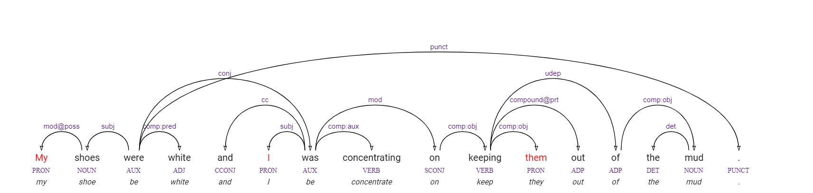
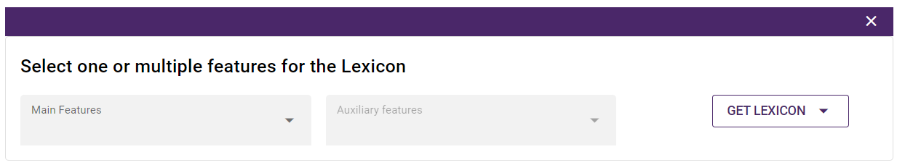
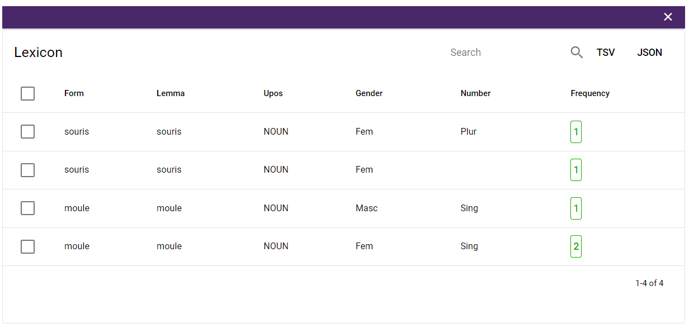
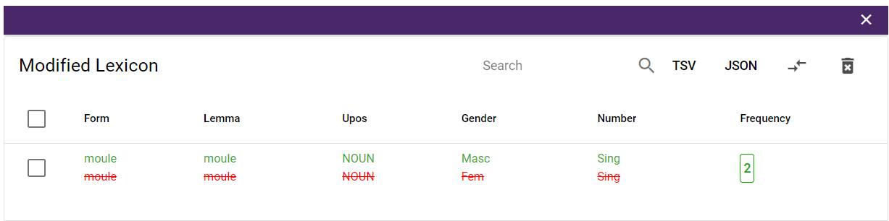

## Welcome to Arborator Grew Documentation

This is the official user documentation for **[Arborator Grew](https://arboratorgrew.elizia.net/#/)**

?> A **collaborative annotation** tool for the **treebank** developpement. 

Below is brief summary of Arborator's main features and user cases. For more details and tutorials, use the navigation bar on the left. 

Let's have a look at the documentation.

## Main Features

Arborator-Grew combines the features of two preexisting tools: `Arborator` and `Grew`. 

> **[Arborator](https://arborator.ilpga.fr/)** is a widely used collaborative graphical online dependency treebank
annotation tool. 

> **[Grew](https://grew.fr/)** is a tool for graph querying and rewriting specialized in structures needed in NLP, i.e. syntactic and semantic
dependency trees and graphs. Grew also has an online version, **[Grew-match](http://match.grew.fr/)**, where all Universal Dependencies treebanks in their classical,
deep and surface-syntactic flavors can be queried.

> **[Arborator Grew](https://arboratorgrew.elizia.net/#/)** opens up new paths of collectively
creating, updating, maintaining, and curating syntactic treebanks and semantic graph banks.

> **[Arborator Grew](https://arboratorgrew.elizia.net/#/)** is adapted better to
**[UD Universal Dependencies](https://universaldependencies.org/)** (Treebank annotation grammar) and **[SUD Surface Syntactic Universal Dependencies](https://surfacesyntacticud.github.io/)** (Distribution based version of UD).

# User Guide 

## Login 

Instead of creating a new account, Arborator-Grew simplifies registration and login for end users.
Arborator-Grew works with two types of social login using  **[Google]()** and **[Github](https://github.com/login)**. 

Use the top right button to select the corresponding social login.

      

## Create a new project 

Arborator-Grew provides new ways to collectively
create, update, maintain and curate syntax treebanks and semantic graph banks. Arborator-Grew makes it easy to create new project and work with collaborators.

You have the possibility to create `Private` project to work on individually or with invited collaborators. Besides that, you can publish the project and make it `Visible` for everyone to see and download or set it as an `Open` project so everyone can collaborate.

To create new project, you start by navigating to the **[Projects list](https://arboratorgrew.elizia.net/#/projects)**. You will find there add button, click on it to open the new project modal.

      

The required fields to create new project on Arborator-Grew in descending order are: 

- The **Project name**, it is what will appear in the projects list and what you will use for browsing .
- The **Description**, it is an overview of the project that outlines its different details. A good description is extremely helpful for the community who are looking for collaboration.
- The **Project Visibility**, projects may be Private (visible and editable only to you and your collaborators) or Visible (only visible) or Open (everyone can contribute).
- **Show All Trees**, this option enable you to see other's trees.
- **Mode exercice**, this will set up the exercice propreties, explained [here](#exercise-mode).

Once you have provided the required information alongside your project, click on “Create” and your project will be created.

## Project Configuration
Once the project is created the administrator can configure the following settings:

- The visibility control, the administrator can update the visibility of the project.
- The adminstartor can enable trees' visibility and [Exercise mode](#exercise-mode) options.
- The administrator can enable the Diff mode option. It allows the user to compare the current opened tree to the diff user tree, the differences will be highlighted. 
- In order to maximize the usefulness of the project, you can upload cover image and add description.

      

A new project uses by default standard [SUD](https://surfacesyntacticud.github.io/) annotation scheme, the user can switch to standard [UD](https://universaldependencies.org/) or propose other scheme in the Annotation settings section.

## Collaborating in projects 

Collaborative annotation is one of powerful features of Arborator-Grew. It provides a way to multiple users to share the access of the project so they can work together.

When you create a project, you are the **owner**. In this case, you have total control over the treebank. You can manage its configuration, invite collaborators and view the trees of other users. 

?> Also, we can distinguish the following roles:

- `Administrator` has the same options as the **owner** except the github synchronization and the project freezing, The **admin** can:
      - Modify the settings of the project.
      - Assign new members to the project.
      - Upload new samples and use the tokenizer.
      - Edit the sentences of a sample (like split or merge tokens ...)
      - Use the parser.
      - View the other users' trees
      - Remove samples, or user's trees.

- `Validator` takes the role of the linguist by choosing the validated tree between the annotators trees.
- `Annotator` Each sample has a list of **annotators**. **Annotators** can browse and modify the treebank (modify in the sense that a modified tree is saved under their name). 

- `Guest` This role is only available for private projects, where you can choose which guests can only see the tree bank.

### Inviting Collaborators

You can invite collaborators directly to your project by accessing the project settings. You can search for the user in the user list, define the role and click on the "share" button.

      

## Treebank Graphic Annotation

To get started with the treebank annotation, you have two options: 
- Import `CoNLL` file as an input. 
- Introduce text as input and use the different options of the tokenizer.

      

Arborator translates the conll data inside into graphical trees. In the annotation user interface: 

?> To make a dependency relation between two tokens, you just need to pull the bow from the token to the other. 

?> To create the root dependency, you need to pull up the bow from  the token. 

?> To change the token's features, you click on it and you can choose and set different features  of `Universal Features` and `Miscellaneous Features` and `Lemmas`

?> To assign a category for the token, you click on the underscore and select the approriate category.

?> To delete annotation, the purple delete button will allow you to delete the different parts of annotation mentionned above.

      <video autoplay loop width="900">
            <source src="assets/videos/1-Annotation.webm" type=video/webm>
      </video>

### Annotation Functionnalities

There is a toolbar located on the top  left of the document area. From it the user can perform these actions:

- Each time a change is made in the tree (e.g. new annotation or relation added), yellow diskette will appear to indicate there are changes to **save**. Click on the **Save button** to **save** the changes. 

- You can activate the difference mode to highlight annotation differences between annotators in the tree structure. This feature can also be activated directly by right-clicking on the user for which you look for differences.  

- You have also the possibility to get a direct `link`, `SVG` file and `CONLL` of the tree.

      

- You can merge tokens, split tokens or insert a token in a specific place. Simply select the token in question from the sentence input in the tree view, you will get these options.

      

## Advanced Options

### Grew search

One of the powerful features of Arborator grew is the pattern matching system. Arborator uses **[Grew](https://grew.fr/)**.

?> You can search based on `POS query`, `Form query`, `Lemma query`, `Dependency relation query` and `Relation and tags query` on the selected trees type.

      

?> The nodes that match the pattern are then highlighted in the
trees on the results page.

      

!> In order to detect the errors, it can filter out these results based on negative
patterns (patterns that must not appear in the graph). Once the faulty tree has been found, it  can then directly be
edited and saved.

You can also display divergences between user annotations using the "Show divergences" option, based on specific features. You must therefore first select a set of features and a set of users for whom you are looking for differences. The user set must contain at least two users. The feature set can be empty, in which case ArboratorGrew will detect any differences that exist between user trees. 
Once the result are displayed activate the diff mode to highlight those divergences.

      

#### Apply rules

With Arborator Grew you can rewrite a rule (see **[Grew Rules](https://grew.fr/doc/rule/)**). 

      

The nodes that matches the rule will be also highlighted in the result page. To save the results the user click on apply rules button.

### Relation tables

Arborator Grew also has the ability to cluster
the results of a query based on one or several features. 

?> This functionality can be used to build a relation table which
summarizes all dependencies within a project, based on the dependency relation. 

      

 

!> Having this is a great way to look for
rare structures and potential errors inside a treebank. The user can access
directly the trees that match the negative pattern and update it. 

### Lexicon 
Lexicon is one of the advanced options available in **[Arborator-Grew](https://arboratorgrew.elizia.net/#)**. The user select two list of features.
- $L_1 = [f_1, …, f_m]$ as main features.
- $L_2 = [g_1, …, g_m]$ as auxiliary features.

      

The output table corresponds to the possible values of all features, such that for all tuples of values for $f_i$, there is more than one tuples of values for $g_i$. The idea is to show only $f$ values which are ambiguous with respect to 
values $g$.

#### Exemple 

For  $L_1 = [$`Form`, `Lemma`, `Upos`$]$ and $L_2 = [$`Gender `, `Number`$]$ 

      

This will show the entries where there is more than one couple of value for `Gender` and `Number` with the same combination (`Form`, `Lemma`, `Upos`)

      

 
After that, the user can correct them directly using the grew rewrite rule option.
  

      

 

?> The second list $L_2$ is optional, if it is not given all the entries of lexicon are displayed.

## Classroom

**[Arborator-Grew](https://arboratorgrew.elizia.net/#)** comes with the concept of the **Classroom**, which is a  great way to teach the undergraduate and graduate students **syntax** using treebank annotation. 

?> Thus, **[Arborator-Grew](https://arboratorgrew.elizia.net/#)** allows the configuration of Exercise mode.

### Exercise mode

This option is set up while the creation of project or using the setting button (Gear button). 

!> Teachers need to have an [administrator](#collaborating-in-projects) status in the project in order to set up an exercise.

For each sample of the project you can configure the exercise mode and determine a **base tree** per sentence that will be used to feedback and calculate the students' scores. The details of different exercise mode are explained below: 

| Exercise level     |property  |
| ------------------- |--------------------------------------------------------------------------  |
| `1:teacher_visible`| 
When Editing, the students can see the teacher's tree, the differences are highlighted in red and they can access to the statistics
|
| `2:local_feedback`|
Here the teacher's tree is not visible, the differences still highlighted and they can access to the statistics.
 |
|`3:global_feedback`|The students can only access to the success statistics|
|`4:no_feedback`|
Nothing is provided only the teacher can see the statistics
|

?> The teacher can export the results of the students into spreadsheets.

## Github Synchronization (upcoming feature)

ArboratorGrew can easily link your project to a github repository.  Many linguists are using Github to hold their treebanks, ArboratorGrew allows you to synchronize with Github in order to follow your updated annotation. Besides that, you can benefit from the collaborative aspect of Github in your ArboratorGew project, if you have collaborators that work directly from Gihtub.

!> In case you have many collaborator working directly from Github, you should  follow some good practices in order to avoid any kind of troubleshooting. These practices are detailed in the following sections.

### Connect using Github Social login

The first step to use this features is to login to ArboratorGrew using your github account in order to grant the access for your github repositories.

### Synchronize your ArboratorGrew project with your Github respository

!> Only the project owner, who can synchronize with Github.

Once you're connected with your Github account, you can synchronize your ArboratorGrew project with Github repository. You need to be the owner or have read and write access to this repository. This synchronization can be made while creating new ArboratorGrew project.

- At "create new project" modal you will have a button that asks you to synchronize with github repository.

      

 

- Or when you click on Github icon in the project page.

      

 

- You will get a list of all your github repositories filtered by the owner.
- Select the repository that you want to sync with and the branch that you want to import.
- After that, you will have two options: work with the branch you selected in the previous step so that all commits and pulls will be in it. Or create a new branch named arboratorgrew which will be used only for commits and pulls made with ArboratorGrew. This option will allow you not to affect the main codebase.

      

 

- ArboratorGrew will import only the conll files that are in the root of your github repository. make sure that your github repository have flattend representation.

### Github workflow

      

 

#### Push to Github

Once your ArboratorGrew project is synchronized with a specific repository and branch, all the changes you made in your project are counted (Save trees, upload new sample, delete sample). When you're ready to commit those changes, you click on the commit button in Github options dropdown.

- It will prompt you to enter a commit message.
- You can choose wether to push only your trees or your trees filled up with the most recent ones.

      

 

#### Pull from Github

ArboratorGrew will only listen to changes made in the branch selected in the previous steps (arboratorgrew or the syncronized branch). if you want to pull down the changes click on the pull button in the github options dropdown, that will refresh the sync in order to obtain the new changes made in your github repository.

      

 

#### Pull request
Once you ready to merge your changes in another branch, you can click on the pull request button. This will allow you to create new pull request.

      

 

#### Desynchronize from github
If you want to disconnect from the github synchronization you can remove it from the remove synchronization button. The files will not be deleted from either github repository or your ArboratorGrew project.

### Best practices

As mentionned above, There are two ways to use the Github Feature. The first is that you're the only person mainting the treebank in ArboratorGrew and you're using the Gihtub as storage. In this case you can work with default branch without using arboratorgrew branch.
The second way for using Github feature is to collaborate with persons working on the treebank directly from Github. Make sure to follow these steps to prevent any conflictual issue.

?> Use arboratorgrew branch on Github and make sure that only one person who can modify it from Github.

!> If you have uncommitted changes made by the collaborators working on ArboratorGrew and at the same time you're pulling changes from Github, the uncommitted changes in ArboratorGrew will be lost and overwritten by the pulled changes.

If you're working with arboratorgrew branch from Github you should proceed as follow:

1. Push all the changes made from ArboratorGrew to Github.
2. Try not to work on the treebank from ArboratorGrew. To do this, you need to deactivate your project using freeze project feature. This will prevent the projects annotators from adding new changes while performing the next steps.

      

 

3. Merge the modifications done outside arboratorgrew branch from Github.

?> While updating arboratorgrew branch you might have some conflicts, try to solve it directly from Github.

4. Pull the changes from Github to your ArboratorGrew branch.

!> If ArboratorGrew detect invalid syntax your changes will not be pulled. Make sure that the changes done in Github are valid.

5. In this step you can unfreeze your ArboratorGrew project.

!> It may happen that you can't find certain organization repositories in your repository list when synchronizing. This happens when you forget to grant access to this organization when you connect to ArboratorGrew with your github account.
To solve this problem, you need to :
1.  Go to https://github.com/settings/applications 
2. Revoke the access to Arborator flask application.

      

  

3. Try to reconnect to ArboratorGrew.
4. You will be redirect to a page where you can select the organization to which you want to grant access.

      

 

