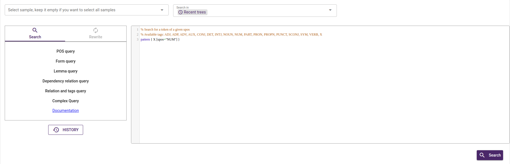
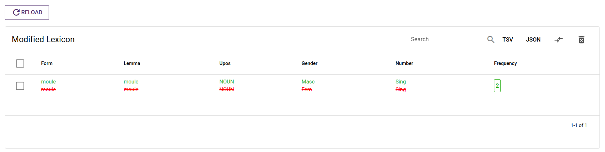

## Tree types

In ArboratorGrew, trees are organized into distinct categories, including:

- **"Your Trees"**: The trees you have worked on.
- **"The Most Recent Trees"**: The latest annotated tree of all sentences.
- **"Your Recent Trees Filled Up with the Most Recent Trees"**: A combination of your recent trees and the most recent trees added.
- **"All Trees"**: An inclusive collection of all available trees.
- **"Validated Trees"**: Trees that have been reviewed and approved by a validator.
- **"Pending Trees"**: Trees associated with sentences that do not have validated trees.

These tree types will be used in the following features.
## Grew search

ArboratorGrew offers an outstanding set of features, not least its powerful pattern search system. With **[Grew](https://grew.fr/)**, ArboratorGrew lets you search using a variety of criteria, including `POS` query, `Form` query, `Lemma` query, `Dependency Relation` query, and `Relation and Tags` query, all matched to the specific type of tree you've selected.

      

?> The nodes that match the pattern are then highlighted in the
trees on the results page.

      

!> In order to detect the errors, it can filter out these results based on negative
patterns (patterns that must not appear in the graph). Once the faulty tree has been found, it  can then directly be
edited and saved.

## Grew Rewrite

With ArboratorGrew you have the ability to modify and rewrite your trees using Grew rewriting rules(see **[Grew Rules](https://grew.fr/doc/rule/)**). 

      

Nodes that match the specified rule will be highlighted on the results page. To save these results, you can choose to either select individual results or opt for all results and then click the 'Apply Rules' button.

## Relation tables

ArboratorGrew also offers the capability to cluster the treebank according to one or multiple features. These features can be employed to construct a relation table that provides a comprehensive summary of all dependencies within a project, focusing on the dependency relation.

      

 

!> Having this is a great way to look for
rare structures and potential errors inside a treebank. The user can access
directly the trees that match the negative pattern and update it. 

## Lexicon 

Lexicon is one of the advanced options available in **[Arborator-Grew](https://arboratorgrew.elizia.net/#)**. The user select two list of features.
- $L_1 = [f_1, …, f_m]$ as main features.
- $L_2 = [g_1, …, g_m]$ as auxiliary features.

      

The output table corresponds to the possible values of all features, such that for all tuples of values for $f_i$, there is more than one tuples of values for $g_i$. The idea is to show only $f$ values which are ambiguous with respect to 
values $g$.

#### Exemple 

For  $L_1 = [$`Form`, `Lemma`, `Upos`$]$ and $L_2 = [$`Gender `, `Number`$]$ 

      

This will show the entries where there is more than one couple of value for `Gender` and `Number` with the same combination (`Form`, `Lemma`, `Upos`)

      

 
After that, the user can correct them directly using the grew rewrite rule option.
  

      

 

?> The second list $L_2$ is optional, if it is not given all the entries of lexicon are displayed.