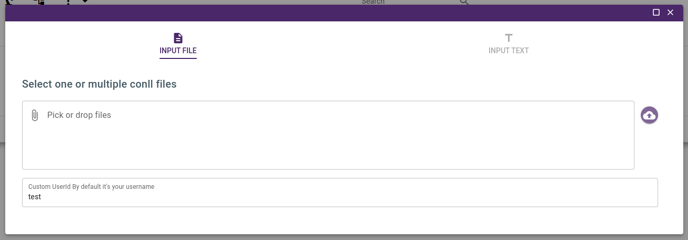
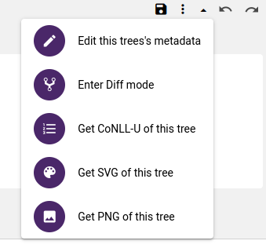
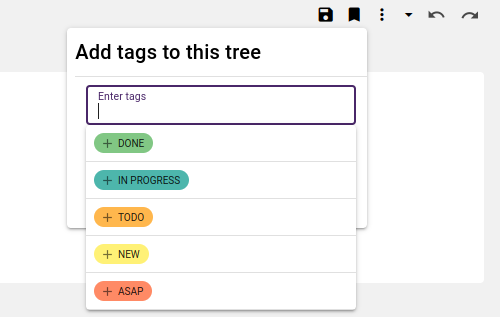
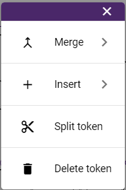

## Treebank Graphic Annotation

To get started with the treebank annotation, you have two options: 
- Import `CoNLL` file as an input. 
- Introduce text as input and use the different options of the tokenizer.

      

Arborator translates the conll data inside into graphical trees. In the annotation user interface: 

?> To make a dependency relation between two tokens, you just need to pull the bow from the token to the other. 

?> To create the root dependency, you need to pull up the bow from  the token. 

?> To change the token's features, you click on it and you can choose and set different features  of `Universal Features` and `Miscellaneous Features` and `Lemmas`

?> To assign a category for the token, you click on the underscore and select the approriate category.

?> To delete annotation, the purple delete button will allow you to delete the different parts of annotation mentionned above.

      <video autoplay loop width="900">
            <source src="assets/videos/1-Annotation.webm" type=video/webm>
      </video>

## Annotation Functionnalities

There is a toolbar located on the top  left of the document area. From it the user can perform these actions:

      

- Each time a change is made in the tree (e.g. new annotation or relation added), yellow diskette will appear to indicate there are changes to **save**. Click on the **Save button** to **save** the changes. 

- You have the option to apply **tags** to your trees using the **tagging feature**. These tags serve as a valuable organizational tool, simplifying your annotation process. Additionally, they facilitate effective collaboration within your team by enabling you to communicate your progress. There are predefined tags available, and you also have the option to create your own tags.

      

- You can activate the difference mode to highlight annotation differences between annotators in the tree structure. This feature can also be activated directly by right-clicking on the user for which you look for differences.  

- You have also the possibility to get a `PNG`, `SVG` file and `CONLL` of the tree.

#### Tokens editing options

- You have the possibility to manipulate tokens within a sentence by merging them, splitting them, or inserting a token at a particular location. To do this, just select the token you want to modify within the sentence input displayed in the tree view, and you will get a menu with these available options.

      

