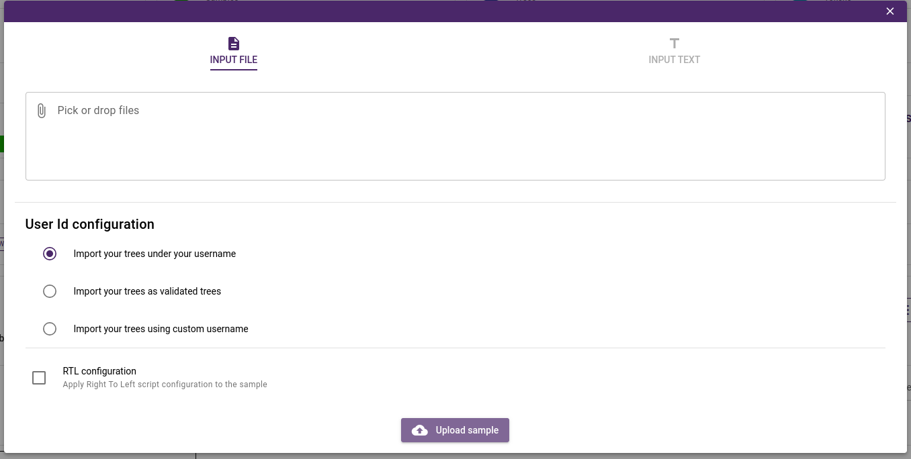
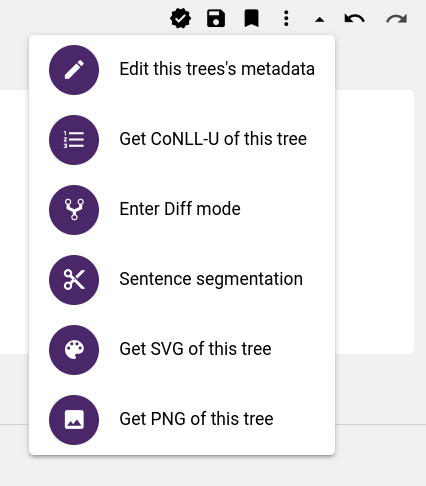
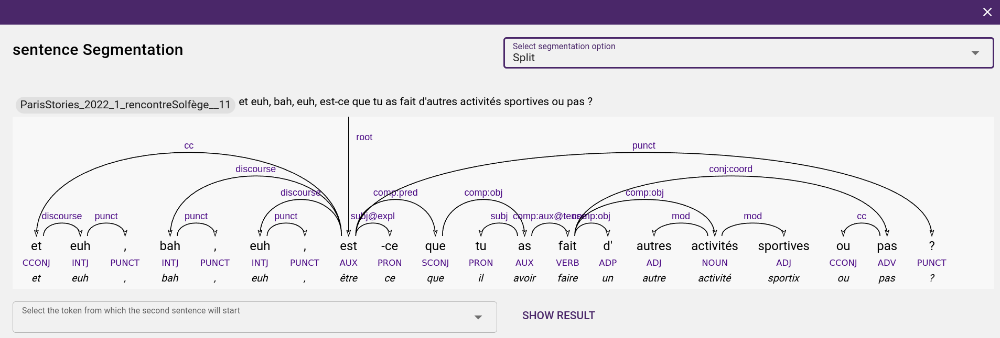
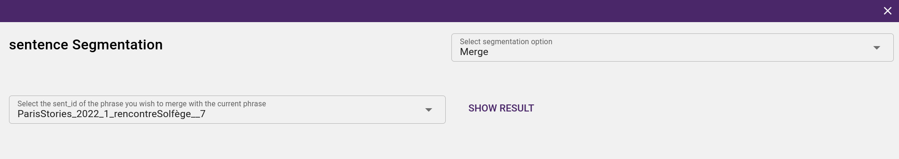
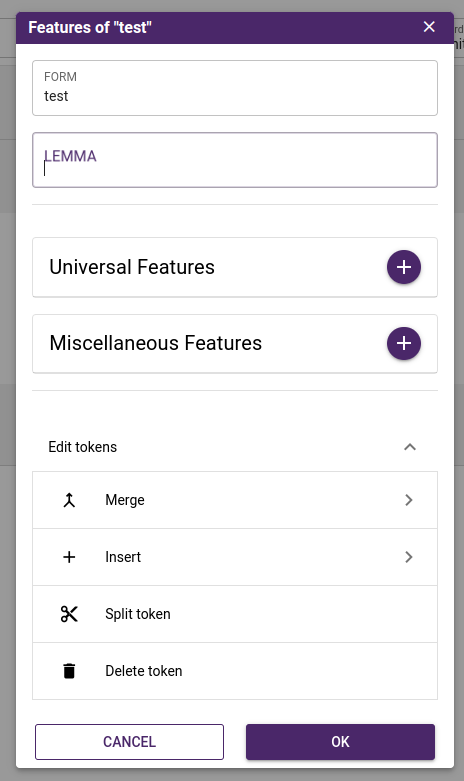
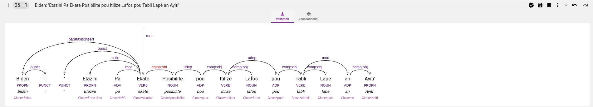

## Treebank Graphic Annotation

To get started with the treebank annotation, you have two options: 
- Import `CoNLL` file as an input. 
- Introduce text as input and use the different options of the tokenizer.
- There is three options for the tokenizer: **tokenizer plain text** for two languages French and english, **horizontal tokenizer** where each sentence on a separate line and **vertical tokenizer** where each token is in a separate line with an empty line indicating the end of the sentence.
- The tokenizer is useful to add new sentences to the samples.
- You can also choose different userId configuration that will be associated to your imported trees.
- For RTL languages, users have to check the RTL option.

      <figure>
            
            <figcaption>Import Conll file</figcaption>
      </figure>

      <figure>
            
            <figcaption>Tokenizer options</figcaption>
      </figure>

Arborator translates the conll data inside into graphical trees. In the annotation user interface: 

?> To make a dependency relation between two tokens, you just need to pull the bow from the token to the other. 

?> To create the root dependency, you need to pull up the bow from  the token. 

?> To change the token's features, you click on it and you can choose and set different features  of `Universal Features` and `Miscellaneous Features` and `Lemmas`

?> To assign a category for the token, you click on the underscore and select the approriate category.

?> To delete annotation, the purple delete button will allow you to delete the different parts of annotation mentionned above.

## Annotation Functionnalities

There is a toolbar located on the top  left of the document area. From it the user can perform these actions:

      

- Each time a change is made in the tree (e.g. new annotation or relation added), yellow diskette will appear to indicate there are changes to **save**. Click on the **Save button** to **save** the changes. 

- You have the option to apply **tags** to your trees using the **tagging feature**. These tags serve as a valuable organizational tool, simplifying your annotation process. Additionally, they facilitate effective collaboration within your team by enabling you to communicate your progress. There are predefined tags available, and you also have the option to create your own tags.

      

- You can activate the difference mode to highlight annotation differences between annotators in the tree structure. This feature can also be activated directly by right-clicking on the user for which you look for differences.  

- You have also the possibility to get a `PNG`, `SVG` file and `CONLL` of the tree.

#### Sentence segmentation

Annotators are usually faced with the problem of sentence segmentation during the annotation process. They want either divide a sentence into two other sentences, or merge two sentences to form a single sentence. This can be done using the sentence segmentation feature. The following screenshots show these two options

      <figure>
            
            <figurecaption>Sentence divison</figurecaption>
      </figure>

      <figure>
            
            <figurecaption>Sentences merge</figurecaption>
      </figure>

#### Tokens editing options

- You have the possibility to manipulate tokens within a sentence by merging them, splitting them, or inserting a token at a particular location. To do this, just select the token you want to modify within the sentence input displayed in the tree view, and you will get a menu with these available options.

      

#### Diff mode
ArboratorGrew help you to efficiently perform pairwise comparaison between two annotations using the diff mode. To activate the diff mode, right click on the user icon that you wish to use as reference for the comparaison. The user icon will change into graduation cap and the changes will be highlighted in red in the open tree. 

      

