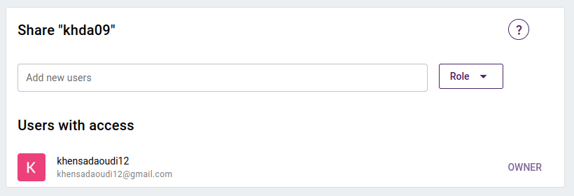

## Collaborating in projects 

Collaborative annotation is one of powerful features of Arborator-Grew. It provides a way to multiple users to share the access of the project so they can work together.

When you create a project, you are the **owner**. In this case, you have total control over the treebank. You can manage its configuration, invite collaborators and view the trees of other users. 

?> Also, we can distinguish the following roles:

- `Administrator` has the same options as the **owner** except the github synchronization and the project freezing, The **admin** can:
  - Modify the settings of the project.
  - Assign new members to the project.
  - Upload new samples and use the tokenizer.
  - Edit the sentences of a sample (like split or merge tokens ...)
  - Use the parser.
  - View the other users' trees
  - Remove samples, or user's trees.

- `Validator` takes the role of the linguist by correcting the treebank and choosing the validated tree between the annotators trees.

- `Annotator` Each sample has a list of **annotators**. **Annotators** can browse and modify the treebank (modify in the sense that a modified tree is saved under their name). 

- `Guest` This role is only available for private projects, where you can choose which guests can only see the tree bank.

## Inviting Collaborators

You can invite collaborators directly to your project by accessing the project settings. You can search for the user in the user list, define the role and click on the "share" button.

      

