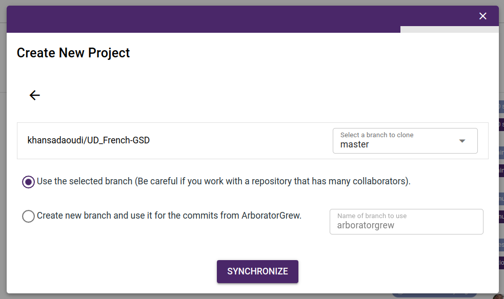
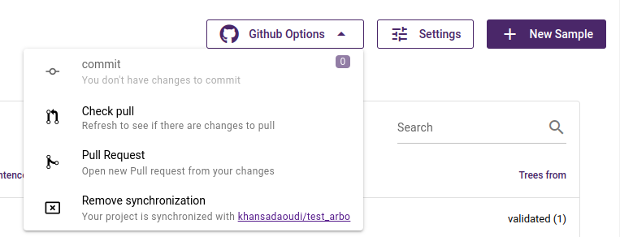
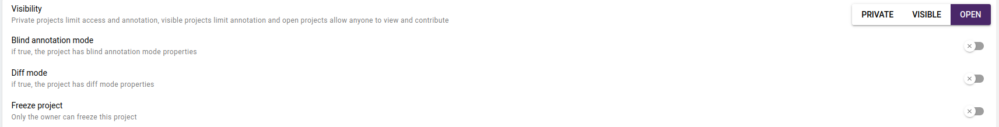

## Github Synchronization

ArboratorGrew offers smooth integration with your GitHub repository, a popular choice among linguists for treebank management. This integration allows you to synchronize easily with GitHub, ensuring that you stay up to date with your annotations. Besides that, it opens up collaboration possibilities by allowing your ArboratorGrew project to become part of GitHub's collaborative environment, making it easy to work with colleagues working directly from GitHub.

!> In case you have several collaborators working directly from GitHub, it's important to follow best practices to prevent potential problems. These recommended practices will be covered in the following sections.

## Connect using Github Social login

The first step to use this features is to login to ArboratorGrew using your github account in order to grant the access for your github repositories.

## Synchronize your ArboratorGrew project with your Github respository

!> Only the project owner, who can synchronize with Github.

After connecting your ArboratorGrew account with your GitHub credentials, you have the option of synchronizing your ArboratorGrew project with a GitHub repository. Please note that you must be the owner of the repository or have read and write access to it. This synchronization process can be launched when you create a new ArboratorGrew" project.

- At "create new project" modal you will have a button that asks you to synchronize with github repository.

      

 

- Or when you click on Github icon in the project page.

      

 

- You will get a list of all your github repositories filtered by the owner.
- Select the repository that you want to sync with and the branch that you want to import.
- After that, you will have two options: work with the branch you selected in the previous step so that all commits and pulls will be in that branch. Or create a new branch named`arboratorgrew`which will be used only for commits and pulls made with ArboratorGrew. This option will allow you preserve you main codebase integrity.

      

 

- ArboratorGrew will import only the conll files that are in the root of your github repository. make sure that your github repository have flattend representation.
- Trees will be imported under the name **validated** and all operations will be performed on these trees.

## Github workflow

      

 

#### Push to Github

Once your ArboratorGrew project is synchronized with a specific repository and branch, all the changes you made in your project are counted (Save trees, upload new sample, delete sample). When you're ready to commit those changes, you click on the commit button in Github options dropdown.

- It will prompt you to enter a commit message.
- You can choose wether to push only your trees, validated trees or your trees filled up with the most recent ones.

      

 

#### Pull from Github

ArboratorGrew will only listen to changes made in the branch selected in the previous steps (arboratorgrew or the syncronized branch). if you want to pull down the changes click on the pull button in the github options dropdown, that will refresh the sync in order to obtain the new changes made in your github repository.

      

 

#### Pull request
Once you ready to merge your changes in another branch, you can click on the pull request button. This will allow you to create new pull request.

      

 

#### Desynchronize from github
If you want to disconnect from the github synchronization you can remove it from the remove synchronization button. The files will not be deleted from either github repository or your ArboratorGrew project.

## Best practices

As mentionned earlier, There are two ways to use the Github Feature. 

The first scenario is when you're the only maintainer in ArboratorGrew and you're using the Gihtub as storage. In this case you can work  directly with the default branch without the need of using `arboratorgrew` branch.

The second way involves collaborating with persons working on the treebank directly from Github. Make sure to follow these steps to prevent any potential conflicts, follow these steps:

?> Use `arboratorgrew` branch on Github and restrict the access to this branch in order to avoid conflicts

!> If you have uncommitted changes from collaborators working on ArboratorGrew while you're pulling changes from Github, the uncommitted changes in ArboratorGrew will be lost and overwritten by the pulled changes.

If you're working with`arboratorgrew`branch from Github, proceed as follow:

1. Push all the changes made from ArboratorGrew to Github.
2. Try not to work on the treebank from ArboratorGrew. To do this, you need to deactivate your project using freeze project feature. This will prevent the projects annotators from adding new changes while performing the next steps.

      

 

3. Merge the modifications done outside`arboratorgrew`branch from Github.

?> While updating`arboratorgrew`branch you might have some conflicts, try to solve it directly from Github.

4. Pull the changes from Github to your ArboratorGrew branch.

!> If ArboratorGrew detect invalid syntax your changes will not be pulled. Make sure that the changes done in Github are valid.

5. In this step you can unfreeze your ArboratorGrew project.

!> It may happen that you can't find certain organization repositories in your repository list when synchronizing. This happens when you forget to grant access to this organization when you connect to ArboratorGrew with your github account.
To solve this problem, you need to :
1.  Go to [Github applications settings](https://github.com/settings/applications) 
2. Revoke the access to Arborator flask application.

      

  

3. Try to reconnect to ArboratorGrew.
4. You will be redirect to a page where you can select the organization to which you want to grant access.

      

 

