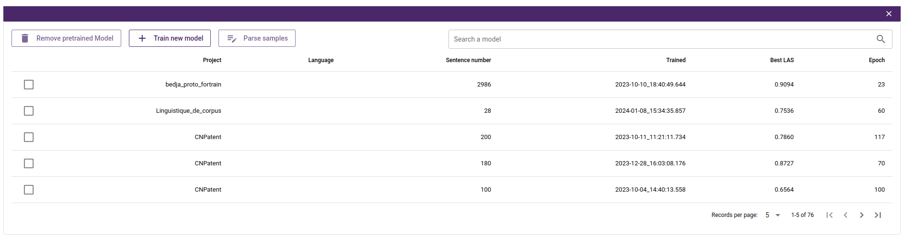

## Parser
ArboratorGrew also offers its own parser for analyzing and annotating Conll data. This parser is specially designed to analyze the grammatical structure of sentences and establish dependency relationships between tokens.

Project administrators can train their own models by configuring various parameters, including training files, parsing files and epochs. In addition, they can use pre-trained models that have been trained in other ArboratorGrew projects and can be adapted to other languages if required.

During the training, you will receive log messages to keep you up to date with the progress of the training or the parsing operation. 

      

 

