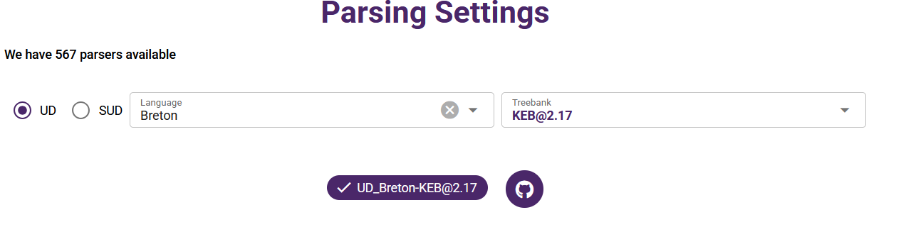

## Introducing QuickParser
Developed by the ArboratorGrew team, **[QuickParser](https://parser.grew.fr/#/parsing)** is a service for syntactic analysis using pretrained models. It allows parsing samples and small corpora in the **[Universal Dependencies (UD)](https://universaldependencies.org)** and **[Surface Universal Dependencies (SUD)](https://surfacesyntacticud.org/)** frameworks. The trees can be visualised or downloaded in the [CoNLL-U format](https://universaldependencies.org/format.html). This service can be useful for quick demonstrations, for testing models and to process corpora that will later be corrected on ArboratorGrew.

## QuickParser models
Like ArboratorGrew parser, QuickParser uses **[BertForDeprel](https://github.com/kirianguiller/BertForDeprel)** parser with **[XLMRoberta embeddings](https://huggingface.co/docs/transformers/model_doc/xlm-roberta)**. Models have been trained on the latest release of the UD and SUD treebanks that contain more than 20,000 tokens. 

To **select a model**, you will need to go to *Parser Settings*, select the desired framework (UD or SUD) and check in the drop-down Language menu if your language is available. For each language, the available selection of training corpora will appear in the drop-down Treebank menu. If you select a treebank, you can then navigate to its description by pressing the GitHub logo (it is displayed only when UD is selected). The trebank's GitHub documentation will provide information on the contents of the treebank (text type, dates etc) and on the annotation (e.g. whether the treebank is lemmatised and/or annotated in morphological features).

      

The number displayed in brackets next to the name of the corpus in the drop-down Treebank menu can be used as an indication of the model's performance. This is the **[Labelled Attachment Score (LAS)](https://universaldependencies.org/conll18/evaluation.html)** of the model trained on the dev part tested on the test part of the corpus. The closer to 1.0 the score, the better the performance of the model on similar data. Models used in QuickParser, however, were trained on the whole corpora, dev, train and test combined to maximise performance. On the principles of data split in UD, see **[UD documentation](https://universaldependencies.org/contributing/repository_files.html#data-split)**.

The actual performance on your data will, however, vary depending on the linguistic proximity between your corpus and the corpus used for training, sentence length and other factors. To evaluate the perfomance of the model on your data, you will need to correct part of your corpus (i.e. create a "Gold" corpus) and use **[evaluation scripts](https://universaldependencies.org/conll18/evaluation.html)**.

The data will be parsed (i.e. annotated in syntactic functions and heads) and tagged (i.e. annotated in parts-of-speech). Depending on the annotation present in the training corpus, the data may also be lemmatised and/or annotated in morphological features.

## Data upload
There are three ways to upload data for syntactic analysis on QuickParser: 
* plain text (up to 50,000 tokens, provided the anticipated number of sentences does not exceed 5,000) - the text needs to be pasted directly into the field provided;
* text file (100,000 tokens if the number of sentences is not greater than 5,000) - a `.txt` file needs to be uploaded;
* CoNLL-U file (100,000 tokens if the number of sentences is not greater than 5,000) - a `.conllu` file needs to be uploaded (please note that any existing syntactic annotation will be overwritten)

## Sentence segmentation and tokenisation
In the case of plain text or text file upload, please be aware that QuickParser performs automatic sentence segmentation using strong punctuation **exclusively for French data**. For these two languages, you can leave "Plain text" option on in "Select format to parse". For other languages, "Vertical" or "Horizontal" option will need to be selected.

* In "Horizontal" format, you will need to start each sentence on a new line and separate tokens with spaces.
* In "Vertical" format, each token begins on a new line and sentences are separated by blank lines.

Please note that you will need to prepare your data for processing depending on the selected format.

## Visualising and downloading QuickParser output
If you uploaded your data in text format, **QuickParser** will convert it into CoNLL-U format. It will then annotate the data using the selected model. This may take several minutes. You can visualise the output either as trees (50 first annotated sentences will be displayerd) or as an annoted CoNLL-U in the [Results](https://parser.grew.fr/#/results) tab. You can download the annotated CoNLL-U by pressing the "Download Output" button and use it for further processing or upload it on ArboratorGrew for correction.

