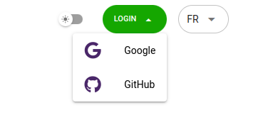
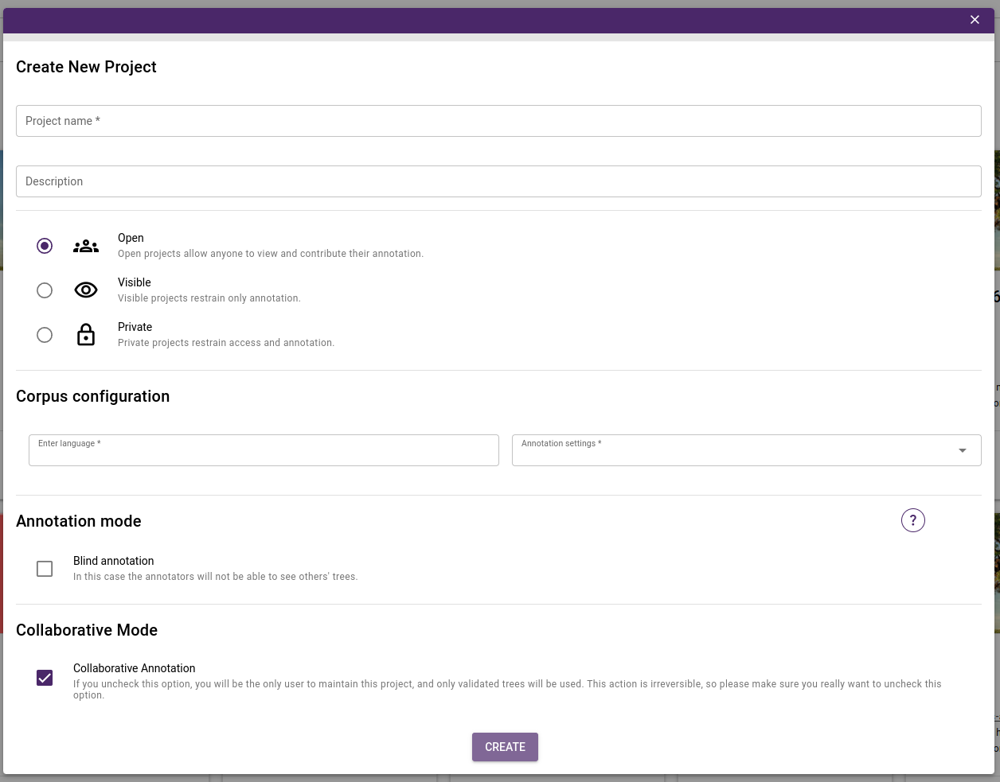
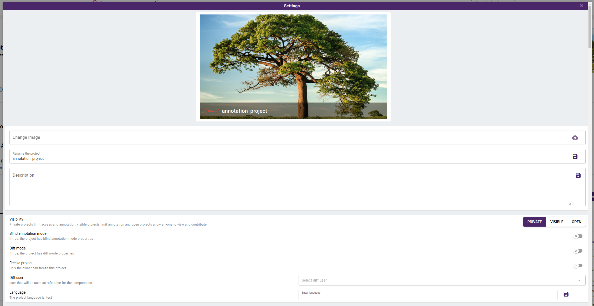

## Login 

Instead of creating a new account, Arborator-Grew simplifies registration and login for end users.
Arborator-Grew works with two types of social login using  **[Google]()** and **[Github](https://github.com/login)**. 

Use the top right button to select the corresponding social login.

      

## Create a new project 

Arborator-Grew provides new ways to collectively create, update, maintain and curate syntactic treebanks.
Arborator-Grew makes it easy to create new project and work with collaborators.

You have the possibility to create `Private` project to work on individually or with invited collaborators. Besides that, you can publish the project and make it `Visible` for everyone to see and download or set it as an `Open` project so everyone can collaborate.

To create new project, you start by navigating to the **[Projects list](https://arboratorgrew.elizia.net/#/projects)**. You will find there add button, click on it to open the new project modal.

      

The required fields to create new project on Arborator-Grew in descending order are: 

- The **Project name**, it is what will appear in the projects list and what you will use for browsing .
- The **Description**, it is an overview of the project that outlines its different details. A good description is extremely helpful for the community who are looking for collaboration.
- The **Project Visibility**, You have the flexibility to create a `Private` project for individual work or collaboration with invited partners. Additionally, you can choose to publish the project, making it `Visible` for everyone to view and download, or designate it as an `Open` project, allowing for collaborative efforts from anyone.
- The **Corpus Configuration**, You need also to set your project's language, simply choose it from the list of languages provided from **[the Glottolog language catalogue](https://glottolog.org/)**. Additionally, you have the option to select your preferred annotation schema, which can be either SUD, UD, EUD, or a custom annotation schema of your choice.

- **Blind annotation mode**, this will set up the blind annotation propreties, explained [here](#blind-annotation-mode).

Once you have provided the required information alongside your project, click on “Create” and your project will be created.

## Project Configuration
After creating the project, the administrator gains access to the following configuration settings:
- The administrator has the ability to update the project's visibility status.
- The administrator can enable or disable the Blind annotation mode.
- The administrator has the option to enable the diff mode, which allows users to compare the currently opened tree with the diff user tree.
- To enhance the project's utility, you can upload a cover image and add a description.

      

